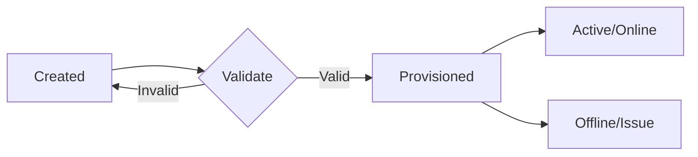

# 02. Provisioning Model & Rules

This document outlines the provisioning logic, validation rules, and state transitions for devices within the Fiber Monitor application.

## 1. Provisioning Concept

In the current architecture (Node.js + Prisma), "provisioning" is the process of activating a device for service. While devices can be created in a `DRAFT` or `INITIALIZED` state, provisioning marks them as `PROVISIONED`, triggering:

1.  **Validation:** Ensuring upstream connectivity and container constraints.
2.  **Resource Allocation:** Assigning management IPs (via simple IPAM).
3.  **Status Calculation:** Triggering the initial optical signal simulation (currently client-side, moving to backend).

### 1.1 State Flow



## 2. Provision Matrix

The following table defines which devices can be provisioned and their prerequisites. This logic is enforced in the `DeviceService` on the backend.

| Device Type | Provisionable? | Required Parent (Container) | Upstream Dependency | Notes |
| :--- | :--- | :--- | :--- | :--- |
| **Supernode** | Yes (Seed) | None | None | Root of the network. Implicitly provisioned. |
| **OLT** | Yes | POP (Recommended) | Supernode (Logical) | Optical Line Terminal. Source of optical signal. |
| **Splitter** | No (Passive) | None | None | Passive optical device. Just passes signal. |
| **ONU** | Yes | None | OLT (Optical Path) | Optical Network Unit. Endpoint at customer side. |
| **Switch** | Yes | None | Supernode (Logical) | Active Ethernet switch (AON). |

**Key Constraints:**
*   **Passive Devices:** (Splitters, ODFs) are *not* provisioned. They exist as physical infrastructure.
*   **Containers:** (POPs, Racks) are structural entities, not provisioned devices.

## 3. Validation Logic

Validation occurs during the `POST /api/devices` (creation) or `PATCH /api/devices/:id` (update) operations.

### 3.1 Validation Steps (Backend)

1.  **Existence Check:** Ensure `deviceId` is valid.
2.  **Container Logic:**
    *   If `parentId` is provided, verify the parent exists and is a valid container (e.g., a `Rack` or `Site`).
    *   *Constraint:* OLTs should ideally be placed inside a POP or Rack.
3.  **Topology Check (Provisioning Phase):**
    *   **ONU:** Must have a valid optical path to an OLT. (Currently calculated client-side, validated server-side in future).
    *   **OLT:** Must have a logical path to a Supernode/Gateway.

### 3.2 Error Handling

| Error Code | HTTP Status | Description |
| :--- | :--- | :--- |
| `DEVICE_NOT_FOUND` | 404 | Device ID does not exist. |
| `INVALID_PARENT` | 400 | The specified `parentId` is invalid or not a container. |
| `ALREADY_PROVISIONED` | 409 | Device is already in a provisioned state. |
| `MISSING_DEPENDENCY` | 422 | Upstream device (e.g., OLT for an ONU) is missing. |

## 4. Implementation Algorithm (TypeScript/Prisma)

The following pseudo-code illustrates the provisioning logic within the API handler:

```typescript
async function provisionDevice(deviceId: string) {
  return await prisma.$transaction(async (tx) => {
    // 1. Fetch Device
    const device = await tx.device.findUniqueOrThrow({ where: { id: deviceId } });

    // 2. Validate State
    if (device.status === 'PROVISIONED') {
      throw new AppError('ALREADY_PROVISIONED', 409);
    }

    // 3. Validate Dependencies (Simplified)
    if (device.type === 'ONU') {
       // Check for upstream OLT link
       const uplink = await tx.link.findFirst({
         where: { targetDeviceId: deviceId }
       });
       if (!uplink) throw new AppError('MISSING_DEPENDENCY', 422);
    }

    // 4. Allocate Resources (IPAM)
    const ipAddress = await ipamService.allocateIp(device.type);

    // 5. Update State
    return await tx.device.update({
      where: { id: deviceId },
      data: {
        status: 'PROVISIONED',
        ipAddress: ipAddress,
        provisionedAt: new Date()
      }
    });
  });
}
```

## 5. Link Rules & Topology

Links define the physical and logical connections. The application enforces specific rules on which devices can be connected.

### 5.1 Link Types

| Source | Target | Link Type | Description |
| :--- | :--- | :--- | :--- |
| **Supernode** | **OLT** | `ETHERNET` | Backhaul connection. |
| **Supernode** | **Switch** | `ETHERNET` | Backhaul connection. |
| **OLT** | **Splitter** | `GPON` | Optical feeder fiber. |
| **Splitter** | **Splitter** | `GPON` | Optical distribution fiber (cascaded). |
| **Splitter** | **ONU** | `GPON` | Optical drop fiber. |
| **OLT** | **ONU** | `GPON` | Direct fiber (Lab/P2P scenarios). |

### 5.2 Validation Rules

*   **No Loops:** The graph should generally be acyclic for the optical distribution network (ODN).
*   **Directionality:** Optical links are typically modeled as bidirectional for physics, but logical signal flows Downstream (OLT -> ONU) and Upstream (ONU -> OLT).
*   **Passive Chain:** A chain of passive devices (Splitters) must eventually terminate at an active device (ONU) or be an open port.

## 6. API Endpoints

### Provisioning Actions

*   `POST /api/devices/:id/provision`
    *   **Action:** Triggers the provisioning workflow.
    *   **Response:** Updated Device object.

*   `POST /api/devices/:id/deprovision`
    *   **Action:** Reverts status to `DRAFT` or `OFFLINE`, releases IP.

### Link Management

*   `POST /api/links`
    *   **Body:** `{ sourceId, targetId, type, attributes }`
    *   **Validation:** Checks `Link Rules` (Section 5.1).

## 7. Future Extensions

*   **Strict Optical Budgeting:** Server-side calculation of dBm loss before allowing provisioning.
*   **Batch Provisioning:** Provisioning an entire OLT chassis or multiple ONUs at once.
*   **Template-based Config:** Applying specific configuration profiles (Speed, VLANs) during provisioning.

